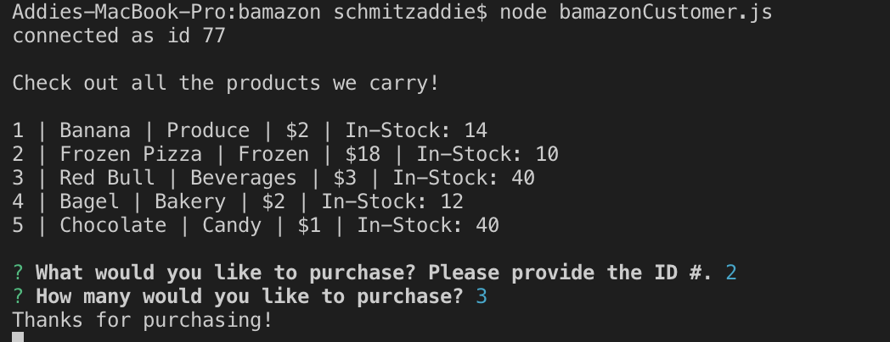
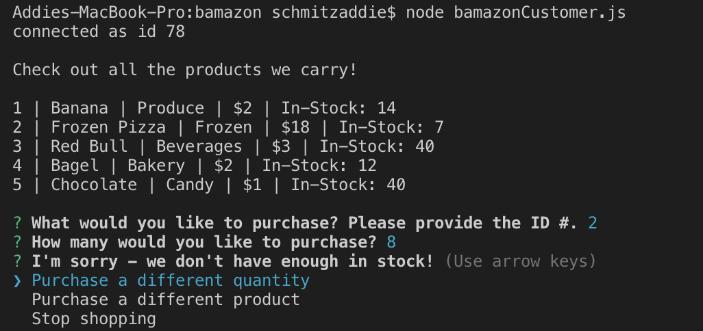
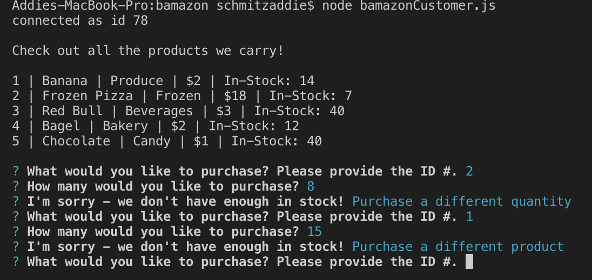
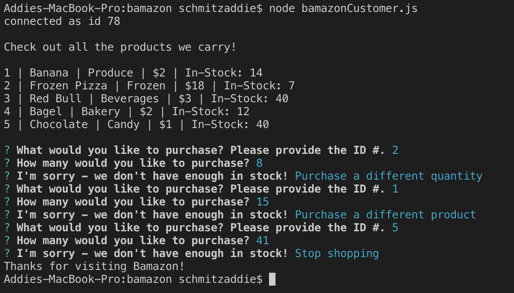

# BAMAZON

Bamazon is a command line storefront application that has a few basic functions; the app displays the list of items that are currently in stock and the quantity and it also allows you to "purchase" items and handles quantity in-stock.

## Dependencies

NPM Install: mysql, inquirer

## SQL Setup

CREATE DATABASE bamazon_db;
USE bamazon_db;

CREATE TABLE products(
item_id INT NOT NULL AUTO_INCREMENT,
product_name VARCHAR(100) NOT NULL,
department_name VARCHAR(100) NOT NULL,
price INT(10) NOT NULL,
stock_quantity INT(10) NOT NULL,
PRIMARY KEY (item_id)
);

## Product List

The application opens to a list of the products that Bamazon currently carries - it provides the customer the ID, the name, the category, the price, and the quanitity in-stock.

## Shopping

The application then prompts the customer to input the product ID # of the item they would like to purchase and the qunitty of they would like to purchase.

## Quantity Control

If the customer selects a product and quantity that is over what is currently in-stock, the application then alerts the customer that there is not enough in-stock for this purchase. It then prompts the customer to select one of the following options; choose a different quantity, choose a different product, or quit shopping.

